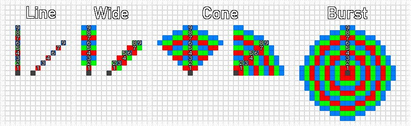

****************************
Combat & Advanced Actions
****************************

Initiative & Turn Order
================================
*Initiative* is the order in which every creature makes their turn during combat. At the very beginning of a fight, before anything else occurs, all combatants must make a Grace roll to determine initiative. The creatures with the highest results take their turns each round in descending order until combat ends.

If two creatures have the same initiative, player characters are given priority, followed by non-player allies, then enemies. Two or more players with the same initiative are allowed to take their turns simultaneously, as long as their turns remain adjacent in the turn order.

Squares & Game Space
================================
The game world takes place on a three-dimensional square grid, comprised of cubes known as *squares* or *spaces* typically 5 paces (5 feet) in width.

Diagonal movement through these squares is twice as expensive for every second diagonal moved; for instance, moving both forward and to the right costs 1 Speed overall, but doing it a second time costs 3 speed, a third time costs 4, and so on. This rule counts against **any movement or range calculation**, which includes normal movement, squares counted for attack range, measuring distance in areas of effect, and more. Any calculation made through all 3 axes of space costs 1 extra square in addition to this rule.

Character Movement
----------------
Creatures take up physical space in the world. They may *squeeze* into spaces meant for those up to one size smaller than themselves; while doing so, they cannot be passed through by others and suffer a -1 die penalty to both attack and defense rolls. Two creatures cannot squeeze within the same square(s).

A creature may pass through the squares of willing allies, but it must squeeze if stopping in those same square(s). Prone or dead creatures may be moved through or stood upon freely. A Large or larger creature can support a number of creatures within the same spaces as it without any of them squeezing, up to one-fourth of its floor space rounded down - 1 for Large, 2 for Huge, 4 for Colossal, etc.

Movement can be made through the square(s) of an enemy, but this immediately provokes an attack of opportunity. Larger creatures do not provoke attacks this way until they can no longer support creatures within the same spaces; this includes both creatures moving within their spaces and them moving over smaller creatures.

Areas of Effect (AoEs)
----------------
Certain effects may take place across more than one square, known as *areas of effect*, or AoEs. These take four forms - Line, Wide, Cone, or Burst - illustrated below.

